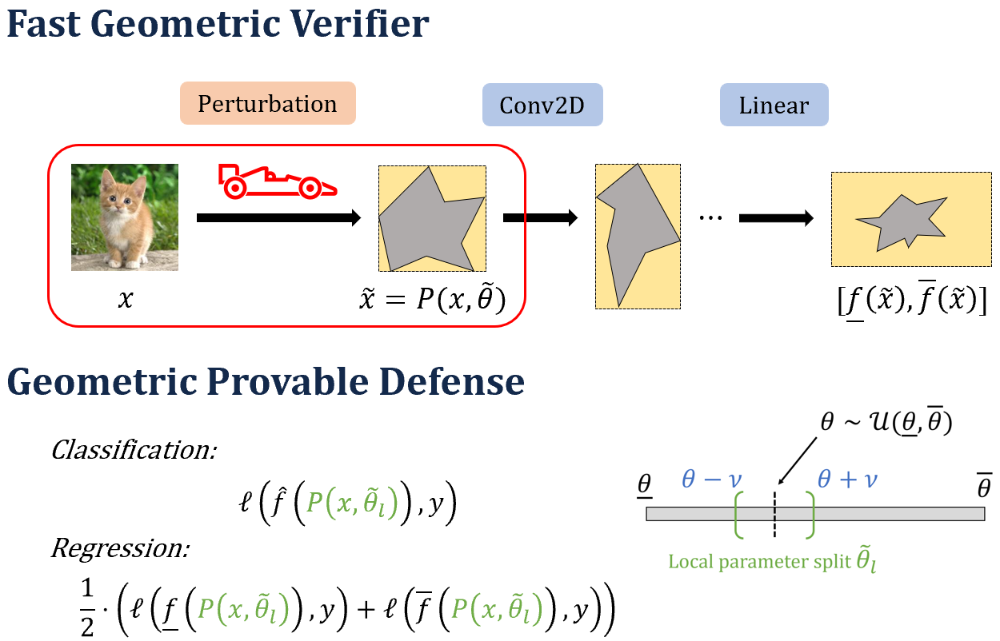

# Provable Defense Against Geometric Transformations
<p align="center"></p>

This codebase contains the implementation for the ICLR 2023 paper "Provable Defense Against Geometric Transformations" by Rem Yang, Jacob Laurel, Sasa Misailovic, and Gagandeep Singh. Our framework is the first for training neural networks to be deterministically certified robust to geometric transformations + speeds up deterministic geometric robustness certification by orders of magnitude compared to the state of the art on MNIST and CIFAR-10. Furthermore, we scale deterministic geometric verification to Tiny ImageNet and the Udacity self-driving datasets for the first time.

## Codebase Overview
1. `train.py`: Main script to train networks.
2. `certify.py` and `certify_driving.py`: Main scripts to certify networks.
3. `configs/`: Contains dataset, network, and perturbation configurations for each experiment.
4. `geometric/`: Contains algorithms for geometric transformations.
5. `networks/`: Contains the trained networks benchmarked in our experiments.

## Requirements
First, install PyTorch via:
```
pip install torch==1.11.0+cu113 torchvision==0.12.0+cu113 torchaudio==0.11.0 --extra-index-url https://download.pytorch.org/whl/cu113
```
Then, install other requirements via:
```
pip install -r requirements.txt
```

## Datasets
The MNIST and CIFAR10 datasets will be automatically downloaded into the `datasets/` folder upon running either the training or certification script. The Tiny ImageNet and Udacity self-driving datasets need to be manually downloaded.
- Tiny ImageNet: Use [this script](https://github.com/Verified-Intelligence/auto_LiRPA/blob/master/examples/vision/data/tinyImageNet/tinyimagenet_download.sh) to obtain the dataset.
- Udacity: First, download the train and test sets from [here](https://github.com/udacity/self-driving-car/tree/master/datasets/CH2) and obtain the labels for the test set from [here](https://github.com/udacity/self-driving-car/blob/master/challenges/challenge-2/CH2_final_evaluation.csv). Then, use rwightman's [udacity-driving-reader](https://github.com/rwightman/udacity-driving-reader) to process the rosbag files. Finally, place the train and test sets into a common `udacity-driving-dataset/` folder and run our script `preprocess_driving.py` to obtain the dataset in tensor format (`driving_train.pt` and `driving_test.pt`).

## Training
Networks can be trained via the following command:  
```
python train.py -d <dataset> -c <config num> -b <batch size> --epochs <epochs> --lr <lr> --save-dir <save directory>
```
- `dataset`: Either 'mnist', 'cifar10', 'tiny-imagenet', or 'driving'.
- `config num`: Integer index of the geometric configuration to use, as specified in `gtss_train` in `configs/<dataset>_config.py`.
- `batch size`: Number of images per mini-batch.
- `epochs`: Number of epochs to train network for.
- `lr`: Learning rate.
- `save directory`: Folder where the trained network will be saved.

## Certification
Classification networks can be certified by running:
```
python certify.py -d <dataset> -c <config num> -p <network path> -b <batch size>
```
- `dataset`: Either 'mnist', 'cifar10', or 'tiny-imagenet'.
- `config num`: Integer index of the geometric configuration to use, as specified in `gtss_certify` in `configs/<dataset>_config.py`.
- `network path`: Path to the network file.
- `batch size`: Number of images per mini-batch.
For some experiments, precomputing all the interpolation grids for all parameter splits may take too much memory; specify the `--np` flag to compute interpolation grids on-the-fly. If precomputed interpolation grids can fit on RAM but not on the GPU, specify the `--cpu-store` flag.

The self-driving network can be certified by running:
```
python certify_driving.py -c <config num> -p <network path> -b <batch size> [--dropout]
```
where the `dropout` flag specifies whether dropout was used during training.
